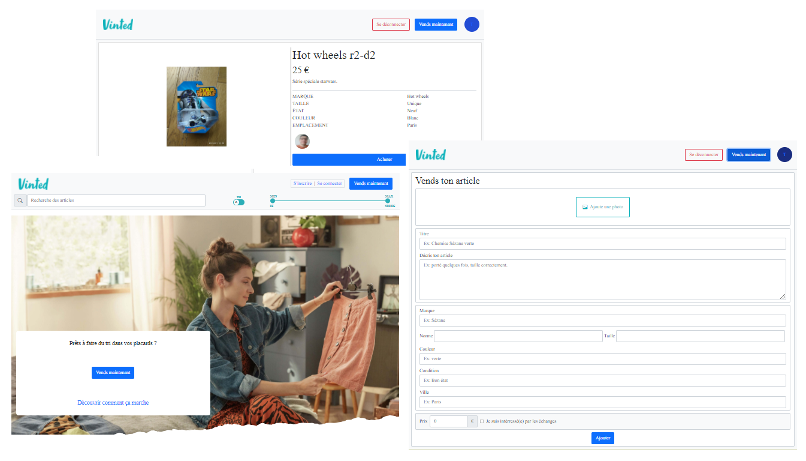

# Bonjour 👋

Les nouvelles technologies et l’univers du web ont toujours attirées ma curiosité.

Simple Hobby pratiqué en parallèle de mon métier de technicien en base de données et de dessinateur industriel, j'ai profité d'un Plan de Sauvegarde de l'Emploi d'un an pour acquérir au fil des jours de l'expérience en développement front-end (React), back-end (Nodejs) et mobile.

J'ai pu développer jusqu'à présent diverses compétences en suivant une formation bootcamp de 3 mois, des cours e-learning et en pratiquant quotidiennement.

N'hésitez pas à me solliciter pour des projets ou si vous avez une opportunité qui me permettrait d'avoir une première expérience professionnelle dans l'un de ces métiers :

💻 Intégrateur Web (HTML, CSS et JavaScript)  
💻 Développeur Front-end (React)  
💻 Développeur Back-end (Node.js)  
💻 Développeur Full Stack MERN

## Contact

📧 [E-Mail](mailto:frmi2018@gmail.com)
🌐 [Portfolio](https://frmi2018.wixsite.com/website)
🌐 [LinkedIn](https://www.linkedin.com/in/franck-michaud-b60791179/)
🌐 [Indeed](https://my.indeed.com/p/g73hfz7)
🌐 [Stack Overflow](https://stackoverflow.com/users/16643299/franck-michaud)
📑 [CV](http://frmi.free.fr/perso/franck.michaud.cv.pdf)

## Mes technologies

  

## Mes compétences

🙂 Je suis actuellement capable

• Réaliser un projet en partant d'une maquette  
• Développer et optimiser des applications ( React / Node.js )  
• Développer de nouvelles fonctionnalités / suivi des tâches ( Kanban )  
• Corriger des anomalies et bugs

• Développer avec les langages : HTML / CSS et Javascript  
• Utiliser un gestionnaire de code source : Git  
• Utiliser un gestionnaire de package : npm ou yarn  
• Créer une API avec Node.js (express)  
• Créer des requêtes vers une API ou BDD ( Axios / fetch / MongoDB / firebase )  
• Utiliser un Framework CSS ( bootstrap / ant design )    
• Utiliser des outils de communication : Slack / Team / Discord / Zoom  
• Utiliser certains services AWS (authentification SES, stockage S3)

• Chercher de façon autonome des solutions ( Google / Stack Overflow )  
• Effectuer de la veille technologique  
• Lire et comprendre des documentations en anglais  
• Suivre des cours e-learning pour apprendre de nouvelles technologies

🤔 J'ai des notions à approfondir ou à mettre en pratique  

• Méthodologie AGILE / Framework Scrum  
• Trello / Jira / Confluence / XMind  
• TypeScript  
• Web Design, UI/UX, Figma  
• SEO / Google Analytics / RGPD  
• Jest [infos](https://jestjs.io/docs/getting-started)  

😉 J'ai testé :

• Framework Expo (mobile)  
• VuesJS  
• Wordpress / wix

😅 To-do-list :  

• React Testing Library [infos](https://testing-library.com/docs/react-testing-library/intro/)  
• jsdom [infos](https://github.com/jsdom/jsdom)  
• Cypress [infos](https://www.cypress.io/)  
• Nock [infos](https://github.com/nock/nock)  
• MSW [infos](https://mswjs.io/)

## Projets React

## Projets Vues

## Projets en ligne

## Ma formation

https://github.com/frmi2018/frmi2018/blob/main/Formation.md

#GH-DARK-MODE-ONLY
