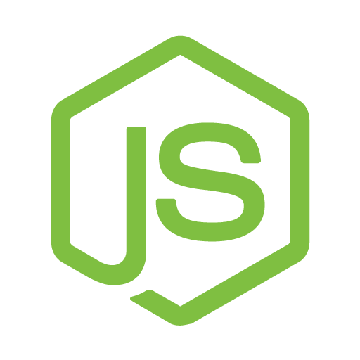
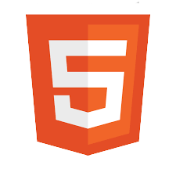

# Bonjour 👋

Commencé en avril 2021 dans le cadre d'un Plan de Sauvegarde de l'Emploi, j'engrange au fil des jours de l'expérience en développement Web.

J'ai pu développer jusqu'à présent diverses compétences en suivant une formation bootcamp, des cours e-learning et en pratiquant quotidiennement.

## Contact

[Mail](mailto:frmi2018@gmail.com)

## Mes compétences

🙂 Je suis actuellement capable :

• Réaliser un projet en partant d'une maquette  
• Développer et optimiser des applications ( React / Node.js )  
• Développer de nouvelles fonctionnalités / suivi des tâches ( Kanban )  
• Corriger des anomalies et bugs

• Développer avec les langages : HTML / CSS et Javascript  
• Utiliser un gestionnaire de code source : Git  
• Utiliser un gestionnaire de package : npm ou yarn  
• Créer des requêtes vers une API ou BDD ( Axios / Express / MongoDB )  
• Utiliser un Framework CSS ( bootstrap / ant design )  
• Faire du CI/CD sur des projets persos avec Github / Heroku / Netlify  
• Utiliser des outils de communication : Slack / Team / Discord / Zoom  
• Utiliser certains services AWS (authentification SES, stockage S3)

• Chercher de façon autonome des solutions ( Google / Stack Overflow )  
• Effectuer de la veille technologique  
• Lire et comprendre des documentations en anglais  
• Suivre des cours e-learning pour apprendre de nouvelles technologies

🤔 J'ai des notions à approfondir ou à mettre en pratique :

• Méthodologie AGILE / Framework Scrum  
• Trello / Jira / Confluence / XMind  
• TypeScript  
• Web Design, UI/UX, Figma  
• SEO / Google Analytics / RGPD

## Mes technologies

 MongoDB  
 Express  
 React / Redux / NextJS / Axios  
 Node.js  
 HTML5  
 CSS3 / SASS  
 Javascript  
 Typescript  
 Framework Expo (mobile)

## Versioning / CI / CD

 Git  
 Github  
 Netlify (front)  
 Heroku (back)

## Projets React

## Projets Vues

## Projets en ligne

## Liens

[LinkedIn](https://www.linkedin.com/in/franck-michaud-b60791179/)  
[Indeed](https://my.indeed.com/p/franckm-fz3kyiq)  
[CV](http://portfolio.michaudfranck.ovh/media/CV.pdf)  
[Site OVH](http://michaudfranck.ovh/)  
[Stack Overflow](https://stackoverflow.com/users/16643299/franck-michaud)
