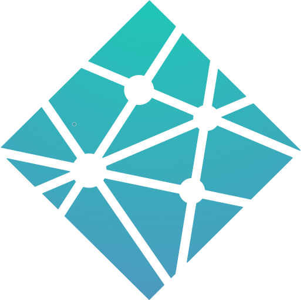

# Bonjour 👋

Les nouvelles technologies et l’univers du web ont toujours attirées ma curiosité.

Simple Hobby pratiqué en parallèle de mon métier de technicien en base de données et de dessinateur industriel, j'ai profité d'un Plan de Sauvegarde de l'Emploi d'un an pour acquérir au fil des jours de l'expérience en développement front-end (React) et back-end (Nodejs).

J'ai développé jusqu'à présent diverses compétences en suivant une formation bootcamp de 3 mois, des cours e-learning et en réalisant divers projets personnels ou tutoriaux.

 Site vitrine  
 Blog  
 Plateform de formation  
 Boutique en ligne  
 Marché en ligne communautaire  
 Portfolio  
 Site de jeux vidéo  
 Marvel

## Projets React

## Projets Vues

## Contact

## Mes technologies

  

